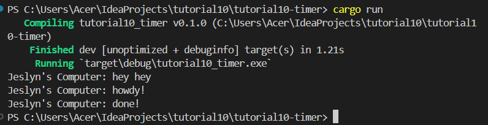
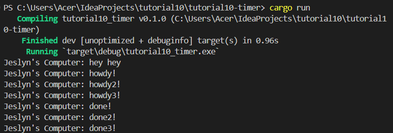

# tutorial10-timer
Output Experiment 1.2:

Karena program menerapkan asynchronous programming, 'Jeslyn's Computer: hey hey' muncul sebelum 'Jeslyn's Computer: howdy!' dan 'Jeslyn's Computer: done!'

Experiment 1.3:

Saat program dijalankan, ketiga fungsi asinkronus yang telah dibuat dan di spawn akan dijalankan pada waktu yang sama (multi-thread), sehingga setelah 'hey hey' dicetak, ketiga 'howdy' dicetak. Setelah 2 detik baru semua 'done' dicetak. Untuk 'drop(spawner)', saat tidak digunakan, program tidak akan berhenti jika tidak dipaksakan. Ini karena tanpa 'drop(spawner)', executor akan menunggu untuk task lain. 